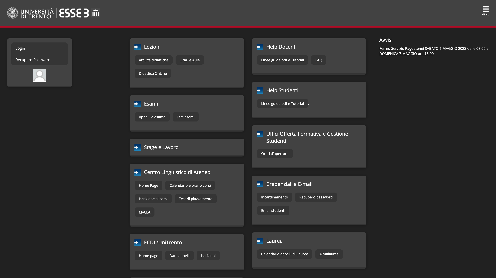
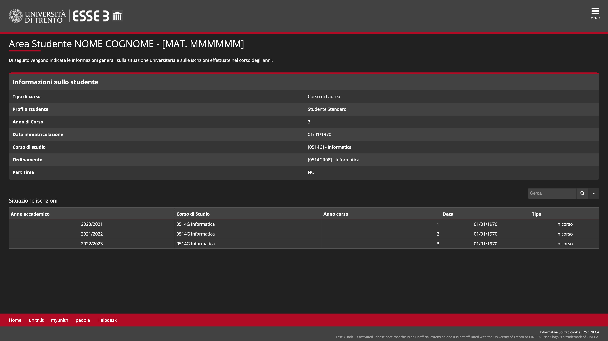
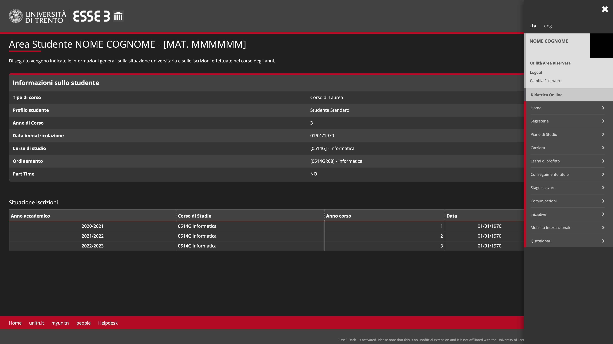

# chromium-dark-esse3-unitn

**Pending review for both Chrome Web Store and Mozilla Firefox.**

A Chromium extension to inject dark mode into UniTrento's career management system (Esse3), specifically designed for UniTN branding and enhanced. Developed and tested under Mozilla Firefox 112.0.1.

## Installation

You can find it packaged on the [Chrome Web Store]() (pending review)

Firefox users have to install it manually by downloading the latest release from the [Releases](https://github.com/deme3/chromium-dark-esse3-unitn/releases) page and dragging the extension package to the browser. Due to Mozilla policies, the extension cannot be published on their store.

## Screenshots

## Manual Installation

The extension can be installed in Developer Mode in any Chromium browser by accessing `chrome://extensions`, toggling Developer Mode and dragging the project folder to the list.

On Firefox, you can install the extension by accessing `about:debugging` and pressing the `Load Temporary Add-on` button, then selecting the `manifest.json` file in the extension folder. **NOTE: This installation differs from the .xpi drag-n-drop mentioned above!**

**Please note that this kind of installations are not meant to be for permanent usage, and should only be done if you know what you're doing.**

## Configuration

Once installed, the extension will provide dark mode (and a few graphical enhancements) for Esse3 (UniTN), to disable, simply access your browser's extensions settings and disable or uninstall the extension.

## Contributing

Contribute freely, we don't need bells and whistles for this tiny project. If you wish to report an issue, please include screenshots of the issue and the **browser you're using**.
